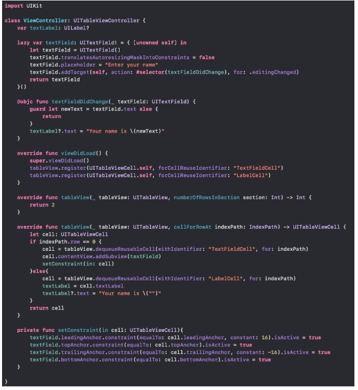

# Declarative and Imperative Programming using SwiftUI and UIKit

# I. Imperative Programming - Lập trình mệnh lệnh

Ta thường sử dụng `UIKit` để lập trình các ứng dụng IOS, và framework này cũng như `AppKit` và `WatchKit` đều sử dụng `programming paradigm - mô hình lập trình` gọi là `imperative programming`.

- `Imperative programming`: là mô hình lập trình mà sử dụng các câu lệnh để thay đổi các trạng thái của chương trình.

- Để lấy ví dụ, khi ta triển khai các function hoặc viết 1 tập hợp các lệnh để được thực thi khi button được nhấn. Hoặc đơn giản hơn nữa là ta có 1 event listener sẽ thực thi các actions khi có 1 event xay ra.

Từ ví trên ta sẽ thấy có 1 vấn đề xảy ra là với các `UI framwork - giao diện framework` là thường đính kém các trạng thái của giao diện vào trong code của mình. Ta thường mong muốn track các trạng thái đó, điều gì xảy ra khi giao diện càng phức tạp và càng nhiều button để track. Điều này dẫn đến code trở lên phức tạp và lớn hơn.

# II. Declarative Programming

- `Declarative Programming`: Là một mô hình lập trình mà sử dụng các logic mà không cần miêu tả `control flow`. Với `declarative programming`, chúng ta nói với ứng dụng rằng những gì nó cần làm và tự handle xự thay đổi các trạng thái của nó khi state thay đổi.

Lấy ví dụ:



Ta thấy rằng ở bên trên ta cần làm `UITableView`, sau đó addObserve `textFieldDidChange`. Nhưng với `SwiftUI` ta chỉ cần 

```swift
struct ContentView: View {
    @State private var name = ""

    var body: some View {
        Form {
            TextField("Enter your name", text: $name)
            Text("Your name is \(name)")
        }
    }
}
```

HollyShit, ta chỉ cần làm 1 đoạn code ngắn như này mà tương đương với cả đoạn code dài UIKit như trên. Ta thấy `@State` attribute, nó sẽ nói rằng swift cần update `name property`. `TextField("Enter your name", text: $name)` cho phép ta update biến `name` với `text filed`, khi `text filed` được update thì biến `name` cũng được update. Điều này được gọi là `two-way binding`.

# II. Source

1. [Declarative and Imperative Programming using SwiftUI and UIKit](https://medium.com/@rmeji1/declarative-and-imperative-programming-using-swiftui-and-uikit-c91f1f104252)