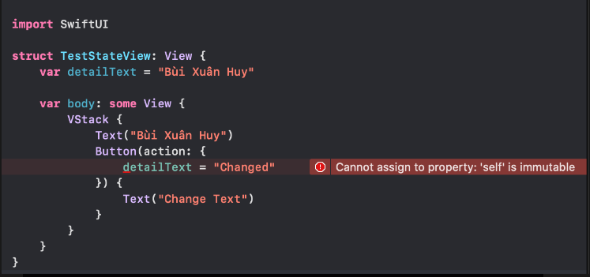
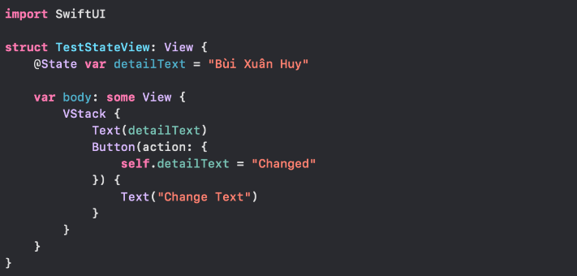

# Property Wrapper

`SwiftUI manages the storage of any property you declare as a state. When the state value changes, the view invalidates its appearance and recomputes the body. Use the state as the single source of truth for a given body.`

Một biến được khai báo là `State` thì ko là value, mà nó có nghĩa là có thể `read hoặc write` value đó. Để truy cập value của biến `State` đó, ta sẽ sử dụng `name của biến đó :)))`. Nó sẽ return lại `wrappedValue property value`.

Ta có thể hiểu đơn giản là `State` bao gồm dữ liệu mà ta đổ lên `View` như `text set cho Label`, data hiển thị lên Tableview hoặc các biến trạng thái như `isVisible` chúng ta tạo ra để set trạng thái cho 1 view hiện ra hoặc ẩn đi. Và khi những giá trị đó thay đổi, `UI sẽ tự động cập nhật thay vì chúng ta phải tự tay gọi các hàm như tableView.reloadData(), titleLabel.isHidden == isVisible, ...`

# I. @State

Trước khi nói về `@State`, có một vấn đề mà các bạn phải nắm được, đó là trong SwiftUI, `các Views đều là Structs`, đồng nghĩa nó các property của nó không thể bị thay đổi. Ta xem ví dụ:

Ta thấy trong ví dụ trên, ta khai báo 1 `Button`, và khi nó được nhấn sẽ thay đổi `detailText`, nhưng nhìn xem ta thấy `compiler` báo lỗi. `self is immutable`, vì bản chất view đó là struct, và ko thể bị thôi đổi. Để giải quyết vấn đề này ta sử dụng `@State`.

Ta sẽ thêm từ khoá `@State` trước khi khai báo. Điều này đồng nghĩa ta sẽ uỷ thác cho `SwiftUI` lưu trữ giá trị biến đó trong bộ nhớ chừng nào View còn tồn tại. Và khi State có sự thay đổi, `SwiftUI sẽ tự động hiểu để cập nhật lại View tương ứng với trạng thái mới nhất của dữ liệu`. Quay lại ví dụ bãn nãy.

`@State` là cách đơn giản, hiệu quả để sử dụng cho thuộc tính có kiểu dữ liệu đơn giản, thuộc về 1 view cụ thể và không bao giờ được truy xuất từ bên ngoài view đó. Do đó các thuộc tính được khai báo `@State` nên được để `private`. Đây không phải điều bắt buộc nhưng nên được thêm vào để chỉ định nó không bao giờ được truy cập bên ngoài view chứa nó.

# II. @ObservedObject

Như đã nói ở trên, @`State` tỏ ra phù hợp với những thuộc tính có kiểu dữ liệu đơn giản. Vậy khi chúng ta muốn khai báo thuộc tính với kiểu dữ liệu phức tạp do chúng ta định nghĩa, hoặc chúng được chia sẻ giữa các views thì sao ??? `@ObservedObject` là một giải pháp. Về cơ bản tư tưởng của `@ObservedObject` khá tương đồng với `@State`, nhưng có vài điểm khác biệt:
- Chúng ta sẽ sử dụng các `External Reference Type` thay cho các `Simple Local Property` như string hay interger. Nhớ là Reference Type nhé, @ObservedObject không thể dùng cho Struct.
- View vẫn tự cập nhật khi data được set cho nó thay đổi, trừ việc data sẽ do chúng ta chịu trách nhiệm quản lý (từ việc tạo thuộc tính, khởi tạo instance, ...)

Khi muốn sử dụng `@ObservedObject`, `hãy đảm bảo Class đã implement ObservableObject protocol (Bắt buộc).` Có 1 số cách để thông báo cho các View rằng data đã bị thay đổi, nhưng đơn giản nhất là sử dụng `@Published` wrapper. Do data được bind lên Views nên hãy đảm bảo việc thông báo data thay đổi và cập nhật giao diện xảy ra trên `Main thread`.

# V. Reference

1. [Phân biệt @State, @ObservedObject, @EnvironmentObject và @Binding trong SwiftUI](https://viblo.asia/p/phan-biet-atstate-atobservedobject-atenvironmentobject-va-atbinding-trong-swiftui-Do754Pe45M6).
2. 