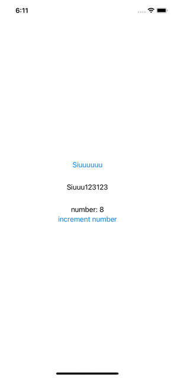

# Property Wrapper

`SwiftUI manages the storage of any property you declare as a state. When the state value changes, the view invalidates its appearance and recomputes the body. Use the state as the single source of truth for a given body.`

Một biến được khai báo là `State` thì ko là value, mà nó có nghĩa là có thể `read hoặc write` value đó. Để truy cập value của biến `State` đó, ta sẽ sử dụng `name của biến đó :)))`. Nó sẽ return lại `wrappedValue property value`.

Ta có thể hiểu đơn giản là `State` bao gồm dữ liệu mà ta đổ lên `View` như `text set cho Label`, data hiển thị lên Tableview hoặc các biến trạng thái như `isVisible` chúng ta tạo ra để set trạng thái cho 1 view hiện ra hoặc ẩn đi. Và khi những giá trị đó thay đổi, `UI sẽ tự động cập nhật thay vì chúng ta phải tự tay gọi các hàm như tableView.reloadData(), titleLabel.isHidden == isVisible, ...`

# I. @State

Trước khi nói về `@State`, có một vấn đề mà các bạn phải nắm được, đó là trong SwiftUI, `các Views đều là Structs`, đồng nghĩa nó các property của nó không thể bị thay đổi. Ta xem ví dụ:


Ta thấy trong ví dụ trên, ta khai báo 1 `Button`, và khi nó được nhấn sẽ thay đổi `detailText`, nhưng nhìn xem ta thấy `compiler` báo lỗi. `self is immutable`, vì bản chất view đó là struct, và ko thể bị thôi đổi. Để giải quyết vấn đề này ta sử dụng `@State`.

Ta sẽ thêm từ khoá `@State` trước khi khai báo. Điều này đồng nghĩa ta sẽ uỷ thác cho `SwiftUI` lưu trữ giá trị biến đó trong bộ nhớ chừng nào View còn tồn tại. Và khi State có sự thay đổi, `SwiftUI sẽ tự động hiểu để cập nhật lại View tương ứng với trạng thái mới nhất của dữ liệu`. Quay lại ví dụ bãn nãy.

`@State` là cách đơn giản, hiệu quả để sử dụng cho thuộc tính có kiểu dữ liệu đơn giản, thuộc về 1 view cụ thể và không bao giờ được truy xuất từ bên ngoài view đó. Do đó các thuộc tính được khai báo `@State` nên được để `private`. Đây không phải điều bắt buộc nhưng nên được thêm vào để chỉ định nó không bao giờ được truy cập bên ngoài view chứa nó.


# II. @StateObject

Đặt vấn đề:

```swift
class StateClass {
    var number: Int = 0
}

struct StateView: View {
    @State var object = StateClass()
    
    var body: some View {
        VStack {
            Text("number: \(object.number)")
            Button("increment number") {
                object.number += 1
                print("number: \(object.number)")
            }
        }
    }
}
```

Ta thấy rằng khi bấm `Button`, giá trị của `number` được tăng lên 1, tuy nhiên nội dung hiển thị trên `textView` không thay đổi. Để giải quyết vấn đề này, ta sẽ sử dụng `@StateObject`.

- Ta đều hiểu rằng `@State và @StateObject` đều được sử dụng để chứa data của view. Chỉ khác ở chỗ `@State` sử dụng để chứa các loại data cơ bản như `Int, String,...`, còn `@StateObject` được sử dụng để chứa data dạng reference, cụ thể là các class.

<a name="example-state"></a>

```swift
class StateObjectClass: ObservableObject {
   @Published var number: Int = 0
}

struct StateObjectView: View {
   // 2
   @StateObject var object = StateObjectClass()
   
   var body: some View {
       VStack {
           Text("number: \(object.number)")
           Button("increment number") {
               object.number += 1
               print("number: \(object.number)")
           }
       }
   }
}
```

Output:



Ta thấy thông qua `@StateObject và @Published`, ta đã track được sự thay đổi của `property number`, và update nó lên screen.

# II. @ObservedObject

Như đã nói ở trên, `@State` tỏ ra phù hợp với những thuộc tính có kiểu dữ liệu đơn giản. Vậy khi chúng ta muốn khai báo thuộc tính với kiểu dữ liệu phức tạp do chúng ta định nghĩa, hoặc chúng được chia sẻ giữa các views thì sao ??? `@ObservedObject` là một giải pháp. Về cơ bản tư tưởng của `@ObservedObject` khá tương đồng với `@State`, nhưng có vài điểm khác biệt:
- Chúng ta sẽ sử dụng các `External Reference Type` thay cho các `Simple Local Property` như string hay interger. Nhớ là Reference Type nhé, @ObservedObject không thể dùng cho Struct.
- View vẫn tự cập nhật khi data được set cho nó thay đổi, trừ việc data sẽ do chúng ta chịu trách nhiệm quản lý (từ việc tạo thuộc tính, khởi tạo instance, ...)

Khi muốn sử dụng `@ObservedObject`, `hãy đảm bảo Class đã implement ObservableObject protocol (Bắt buộc).` Có 1 số cách để thông báo cho các View rằng data đã bị thay đổi, nhưng đơn giản nhất là sử dụng `@Published` wrapper. Do data được bind lên Views nên hãy đảm bảo việc thông báo data thay đổi và cập nhật giao diện xảy ra trên `Main thread`.

- Về cơ bản giống hệt `@StateObject`, `@ObservedObject` cũng được sử dụng để chứa class properties, ngay cả nguyên tắc viết class cũng giống hệt với `@StateObject`

```swift
struct ObservedObjectView: View {
    @ObservedObject var object = StateObjectClass()
    
    var body: some View {
        VStack {
            Text("number: \(object.number)")
            Button("increment number") {
                object.number += 1
                print("number: \(object.number)")
            }
        }
    }
}
```

Tuy nhiên với ví dụ bên trên, đó ko phải là cách dùng chính xác của `@ObservedObject`. Bây giờ ta sẽ phân biệt sự khác nhau của `@StateObject` và `@ObservedObject`.
- `@StateObject`: Là 1 phần và được quản lý bởi View đó. Nó được thực thi trước khi body của View được khởi tạo. Đơn giản ở ví dụ phần <a href="#example-state">này</a>, ta thấy rằng `@ObservedObject var object = StateObjectClass()` biến `object` đã được khởi tạo ngay trong View của nó.
- `@ObserverObject`: Không phải là 1 phần của View, vì thế tất nhiên là không được quản lý bởi View. Không có gì đảm bảo được rằng trong body, data của `@ObservedObject` đã được sẵn sàng. Có thể gây ra crash App nếu data chưa tồn tại. Ta thấy trong ví dụ này <a href="#correct-observe">này</a>, `class SomethingView` chưa khởi tạo `viewModel`, mà nó sẽ được truyền từ `ObservView`. Đơn giản là Data được pass từ `@StateObject -> @ObservedObject.`

<a name="correct-observe">

```swift
class NetworkManager: ObservableObject {
    @Published var name: String = "Siuuu"
}

struct SomethingView: View {
    @ObservedObject var viewModel: NetworkManager
    
    var body: some View {
        Button {
            viewModel.name += "123"
        } label: {
            Text("Siuuuuuu")
        }
    }
}

struct ObservView: View {
    @StateObject var viewModel = NetworkManager()
    
    var body: some View {
        VStack(spacing: 30) {
            SomethingView(viewModel: viewModel)
            Text(viewModel.name)
        }
    }
}
```

- Lưu ý khi sử dụng `StateObject` và `@ObservedObject`: 
Sử dụng `@StateObject, @ObservedObject` không đúng cách có thể gây ra hiện tượng mất dữ liệu theo một cách chúng ta không mong muốn. Vì vậy có 2 lưu ý chúng ta cần chú ý như sau:
- Lưu ý 1: Trong trường hợp ta dùng sai, như việc khởi tạo giá trị cho `@ObservedObject` trong View, có thể dẫn đến mất data.

```swift
class StateObjectClass: ObservableObject {
   @Published var number: Int = 0
}

struct StateObjectView: View {
    @StateObject var object = StateObjectClass()
    
    var body: some View {
        VStack {
            Text("number: \(object.number)")
            Button("increment number") {
                object.number += 1
                print("number: \(object.number)")
            }
            
            ObservedObjectView()
        }
    }
}

struct ObservedObjectView: View {
    @ObservedObject var object = StateObjectClass()
    var body: some View {
        VStack {
            Text("number: \(object.number)")
            Button("increment number") {
                object.number += 1
                print("number: \(object.number)")
            }
        }
    }
}
```

Output:


Ta thấy rằng khi nhấn cả 2 button, để ý sẽ thấy mỗi khi bấm button của `StateObjectView`, giá trị của `object.number` trong `ObservedObjectView` ngay lập tức bị reset về giá trị khi khởi tạo ban đàu.  Giải thích rằng khi ta nhấn `Button của StateObjectView`, thì ta sẽ update `Text của StateObjectView`, mà khi update 1 phần tử, nó sẽ reload lại cả View đó. Dẫn tới thằng `ObservedObjectView` cũng sẽ bị reload lại theo. Mà ta nhớ rằng `@ObservedObject` không được “giữ” bởi View,  cũng không được giữ ở bất kỳ đâu, nên khi ObservedObjectView bị load lại, giá trị sẽ được khởi tạo lại. Vì vậy ta cần khai báo thằng cha, rồi truyền vào thằng con. Lúc này thằng cha sẽ giữ `@ObservedObject` nên dữ liệu sẽ ko bị load lại.

# IV. @EnvironmentObject

Tương tự như `@StateObject` và `@ObservedObject`, `@EnvironmentObject` được sử dụng để quản lý data dạng class cho View. Tuy nhiên, cách viết và cách sử dụng của `@EnvironmentObject` không giống với 2 loại property wrapper trên.

Về cách sử dụng, `@EnvironmentObject` giống với `@ObservedObject` ở chỗ cũng là data được pass từ View khác tới , tuy nhiên nó khác với `@ObservedObject` ở chỗ `@ObservedObject` được sử dụng khi pass data từ `View cha -> View con`, còn `@EnvironmentObject` Khi data được pass từ View cha, bất kỳ View con nào trong hệ thống View đều có thể lấy ra sử dụng, không phải pass data qua nhiều cấp.


# V. Reference

1. [Phân biệt @State, @ObservedObject, @EnvironmentObject và @Binding trong SwiftUI](https://viblo.asia/p/phan-biet-atstate-atobservedobject-atenvironmentobject-va-atbinding-trong-swiftui-Do754Pe45M6).
2. 