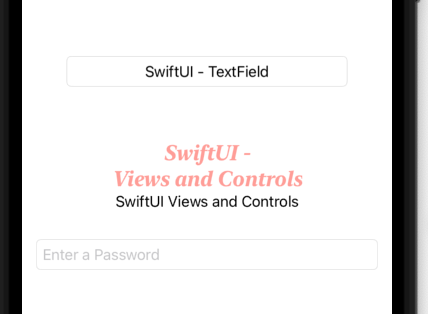

# Views-Control

`SwiftUI` provides the views and controls in the sameway as `UIKit` to present our content on the screen and as well to handle the user interactions.

`Views` and `controls` are the visual building blocks of your app’s user interface. Use them to present your app’s content onscreen. `Views represent text, images, shapes, custom drawings, and compositions of any and all of these together. Controls enable user interaction with consistent APIs that adapt to their platform and context.`

# I. View

`Every custom view in SwiftUI conforms to the View Protocol.`

```swift
struct ArticleView: View {
  var body: some View {
    Text(“SwiftUI - \nViews and Controls”)
    .font(.system(size: 24, weight: .bold, design: .serif))
    .italic()   //In nghiêng
    .opacity(0.5)
    .lineLimit(2)
    .multilineTextAlignment(.center)
    Text("SwiftUI") + Text(" ") + Text ("Views and Controls")
  }
}
```


# II. TextField

```swift
struct ContentView: View {
    @State var tName : String = "SwiftUI - TextField"
    var body: some View {
        TextField("Placeholder", text: $tName)
            .textFieldStyle(RoundedBorderTextFieldStyle())
            .padding(50)
            .multilineTextAlignment(.center)
        ArticleView()
        SecurityFiled()
    }
}

struct SecurityFiled: View {
    @State var tName : String = ""
    var body: some View {
        
        SecureField("Enter a Password", text: $tName)
        .padding()
        .textFieldStyle(RoundedBorderTextFieldStyle())
        
}}
```

Output:



