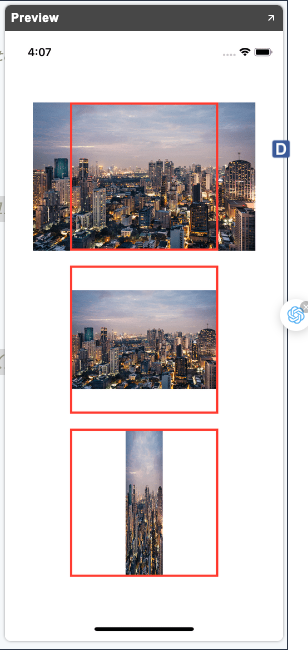
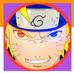

# Views-Control

`SwiftUI` provides the views and controls in the sameway as `UIKit` to present our content on the screen and as well to handle the user interactions.

`Views` and `controls` are the visual building blocks of your app’s user interface. Use them to present your app’s content onscreen. `Views represent text, images, shapes, custom drawings, and compositions of any and all of these together. Controls enable user interaction with consistent APIs that adapt to their platform and context.`

# I. View

`Every custom view in SwiftUI conforms to the View Protocol.`

```swift
struct ArticleView: View {
  var body: some View {
    Text(“SwiftUI - \nViews and Controls”)
    .font(.system(size: 24, weight: .bold, design: .serif))
    .italic()   //In nghiêng
    .opacity(0.5)
    .lineLimit(2)
    .multilineTextAlignment(.center)
    Text("SwiftUI") + Text(" ") + Text ("Views and Controls")
  }
}
```


# II. TextField + SecureField

`TextFiled + SecureField`:

```swift
struct ContentView: View {
    @State var tName : String = "SwiftUI - TextField"
    var body: some View {
        TextField("Placeholder", text: $tName)
            .textFieldStyle(RoundedBorderTextFieldStyle())
            .padding(50)
            .multilineTextAlignment(.center)
        ArticleView()
        SecurityFiled()
    }
}

struct SecurityFiled: View {
    @State var tName : String = ""
    var body: some View {
        SecureField("Enter a Password", text: $tName)
        .padding()
        .textFieldStyle(RoundedBorderTextFieldStyle())
        
}}
```

Output:


# III. Image

Ta thấy rằng phải xét `aspectRatio` trước rồi mới xét `frame`.

```swift
VStack(spacing: 20) {
    Image("Bangkok")
        .resizable()
        .aspectRatio(contentMode: .fill) // .scaledToFill()
        .frame(width: 200, height: 200)
        .border(Color.red, width: 3)
    Image("Bangkok")
        .resizable()
        .aspectRatio(contentMode: .fit) // .scaledToFit()
        .frame(width: 200, height: 200)
        .border(Color.red, width: 3)
    Image("Bangkok")
        .resizable()
        .aspectRatio(0.25, contentMode: .fit)
        .frame(width: 200, height: 200)
        .border(Color.red, width: 3)
}
```

Output tương ứng: 



Ta cũng có thể sử dụng `scaleEffect` để tăng size view hoặc `.rotationEffect(.degrees(100))` để xoay

# IV. Button

```swift
struct ButtonView: View {
    var body: some View {
        Button {
            print("Siuuuuu")
        } label: {
            Text("Quần què")
        }
        
        Button {
            print("Do something")
        } label: {
            Image("naruto")
                .resizable()
                .aspectRatio(contentMode: .fill) //fill image with button
                .frame(width: 150, height: 150)
                .clipped()
                .cornerRadius(75)
                .overlay {
                    RoundedRectangle(cornerRadius: 75)
                                  .stroke(Color.red, lineWidth: 6)
                }
        }
        .frame(width: 150, height: 150)  
        .cornerRadius(25)
        .background(.purple)
    }
}
```

Output:



# V. NavigationLink

A button that triggers a navigation presentation when pressed which is just like a `pushViewController` and it is the replacement in SwiftUI