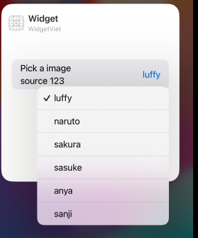

# Overview and Practice 

# I. Overview

Ở phần này ta sẽ ôn lại tổng quát lý thuyết `Widget`. Đây là phần khởi tạo 1 `Widget`:


```swift
struct WidgetLuffy: Widget {
    let kind: String = "WidgetLuffy"

    var body: some WidgetConfiguration {
        AppIntentConfiguration(kind: kind, 
                               intent: ConfigurationAppIntent.self,
                               provider: Provider()) { entry in
            WidgetLuffyEntryView(entry: entry)
                .containerBackground(.fill.tertiary, for: .widget)
        }
        .contentMarginsDisabled()
    }
}


```

Ở đây ta có các thành phần quan trọng sau:
- `intent`: Đây là 1 struct comform với protocol `WidgetConfigurationIntent`, có nhiệm vụ chính là cung cấp các action cho phần `EditWidget`
- `Provider`: Đây là 1 struct comform với protocol `AppIntentTimelineProvider`, có nhiệm vụ chính là cung cấp `timeline` và dữ liệu `entry` tới `View`. Bên cạnh đó, nó cũng sẽ được sử dụng để khi `edit intent`, mỗi khi `edit widget`, nó sẽ gọi method `timeline` của `provider`.

# 1.1 Intent

Như đã nói `intent`: Đây là 1 struct comform với protocol `WidgetConfigurationIntent`, có nhiệm vụ chính là cung cấp các action cho phần `EditWidget`. Ta sử dụng thằng `AppIntent` hầu như cho việc `Edit Widget`.

```swift
struct ConfigurationAppIntent: WidgetConfigurationIntent {
    static var title: LocalizedStringResource = "Configuration"
    static var description = IntentDescription("This is an example widget.")


    @Parameter(title: "Pick a imagesource")
    var image: ImageSource
}

struct Provider: AppIntentTimelineProvider {
    func timeline(for configuration: ConfigurationAppIntent, in context: Context) async -> Timeline<GameStatusEntry> {}
}
```

Ta thấy method `timeline` có 1 biến `configuration` thuộc kiểu `ConfigurationAppIntent`, nó chính là thằng `Intent` ta đang nói đến. Trong `Intent`, ta đã khai báo 1 kiểu dữ liệu mới đó là `ImageSource` comform với `AppEntity` (nhớ rằng với các kiểu dữ liệu ta custom cần phải được comform với `AppEntity`). Lúc này thằng `image thuộc kiểu imageSource` sẽ là thằng ta sử dụng để show thông tin với người dùng và cho phép người dùng edit.

```swift
struct ImageSource: AppEntity {
    
    var id: String
    
    static var defaultQuery: ImageQuery = ImageQuery()   //EntityQuery
        
    var image: ImageType
    
    static var allImage: [ImageSource] {
        ImageType.allCases.map { image in
            return ImageSource(id: image.rawValue, image: image)
        }
    }
    
    static var typeDisplayRepresentation: TypeDisplayRepresentation = "Image Viet"
    
    var displayRepresentation: DisplayRepresentation {
        DisplayRepresentation(title: "\(id)")
    }
}
```  

Trong phần `ImageSource`, ta có khai báo `static var defaultQuery: ImageQuery = ImageQuery()`, bây giờ ta cần chú ý đến phàn `ImageQuery`:

```swift
struct ImageQuery: EntityQuery {
    
    func entities(for identifiers: [ImageSource.ID]) async throws -> [ImageSource] {
        return ImageSource.allImage.filter { imageSource in
            return identifiers.contains(imageSource.id)
        }
        
    }
    
    func suggestedEntities() async throws -> [ImageSource] {
        ImageType.allCases.map { image in
            return ImageSource(id: image.rawValue, image: .luffy)
        }
    }
    
    func defaultResult() async -> ImageSource? {
        try? await suggestedEntities().first
    }
}
```

Ở đây ta sẽ chú ý rằng có 3 hàm: `- Quan trọng đấy nhớ đọc kĩ`
- `suggestedEntities`: Thằng này sẽ suggest tất cả giá trị cho user khi edit, nhìn ảnh dưới đây, vì `ImageType` có 6 `case`  nên nó sẽ có suggest 6 thực thể.



- `defaultResult`: Nó sẽ return default. cái này thi ko cần quan tâm
- `entities`: Thằng này sẽ là return thằng đang được chọn hiện tại. // not sure

